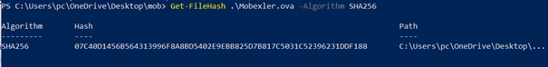

# LAB 1 : Mise en place du lab 
1- Vérification de l’intégrité du fichier

  

Le hash SHA-256 fourni par la page officielle correspond à celui obtenu par la commande, ce qui confirme l’intégrité du fichier Mobexler.ova.

2- Configuration du VM 

3- Vérification de l’installation et de la connectivité réseau

Host-Only: IP 192.168.56.103, broadcast 192.168.56.255
NAT : IP 10.0.2.15

La connexion Internet a été vérifiée et fonctionne correctement

4-Création du snapshot
