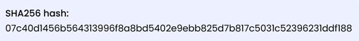
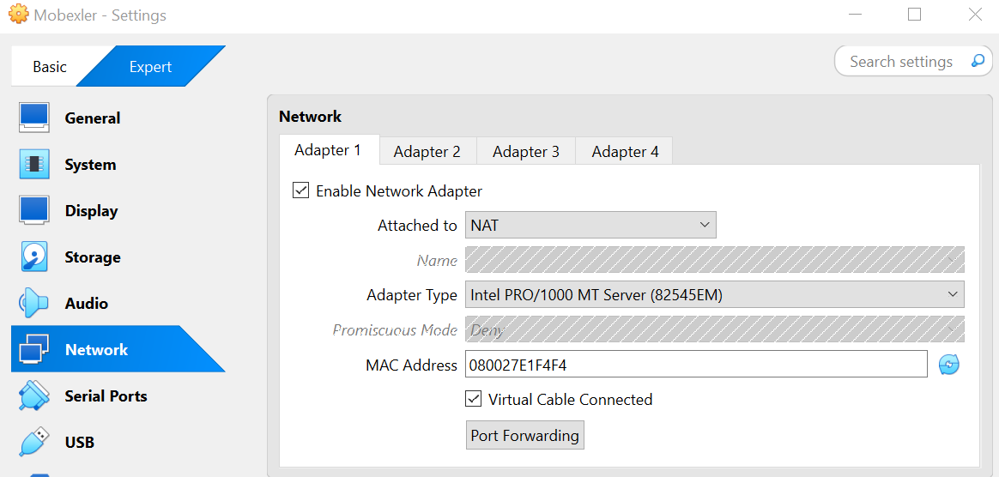
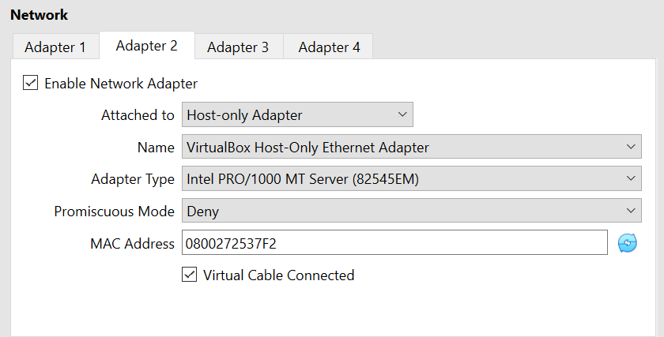
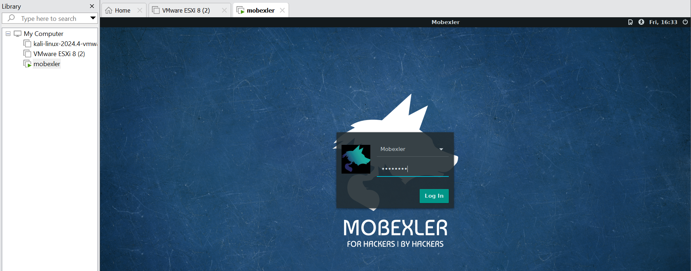
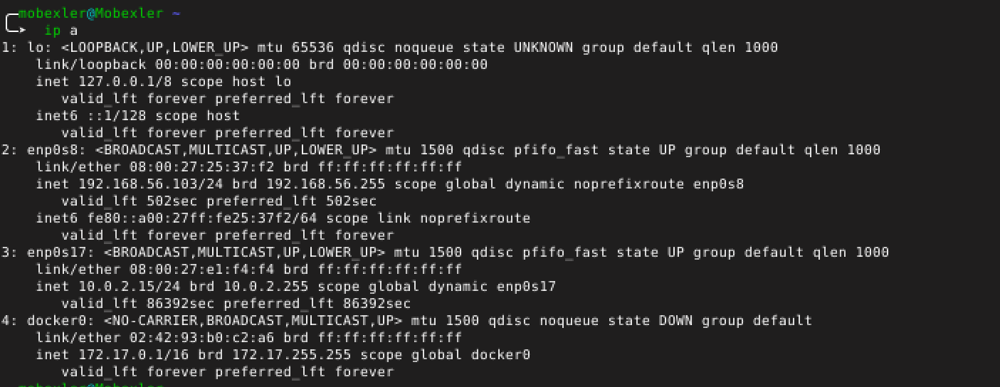
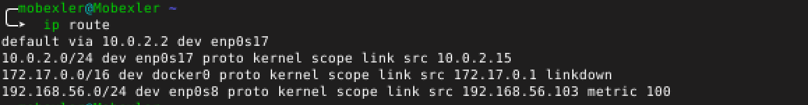
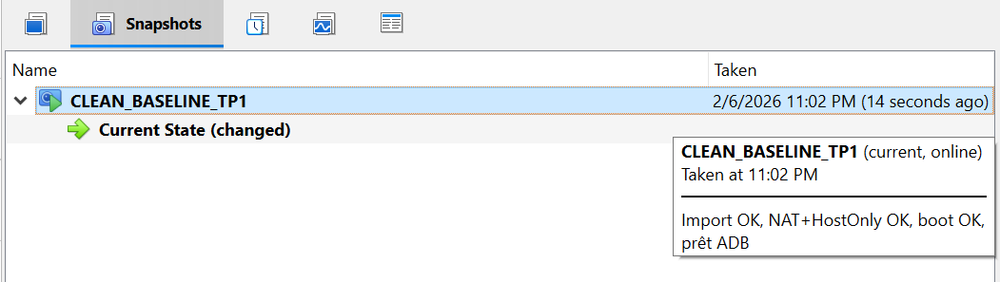
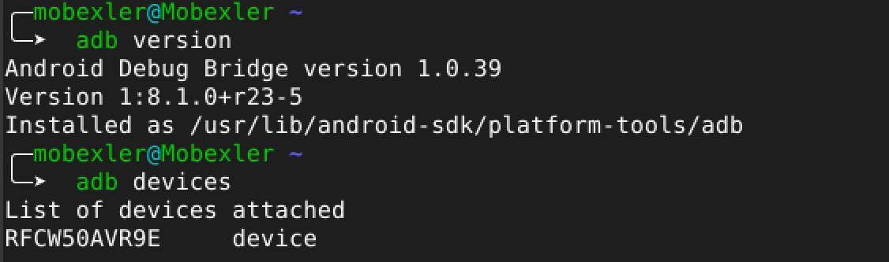

# LAB 1 : Mise en place du lab 
1- Vérification de l’intégrité du fichier

  

  

Le hash SHA-256 fourni par la page officielle correspond à celui obtenu par la commande, ce qui confirme l’intégrité du fichier Mobexler.ova.

2- Configuration du VM 

  

  

  

3- Vérification de l’installation et de la connectivité réseau

  

Host-Only: IP 192.168.56.103
NAT : IP 10.0.2.15

  

La connexion Internet a été vérifiée et fonctionne correctement

4-Création du snapshot
On crée un snapshot comme point de restauration afin de pouvoir revenir à un état fonctionnel de la machine virtuelle en cas de dysfonctionnement lors des travaux pratiques.

  

5-Configuration de la cible Android

  

  

  
</p
