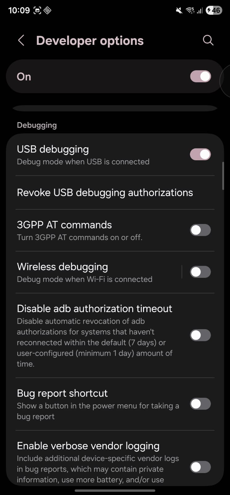
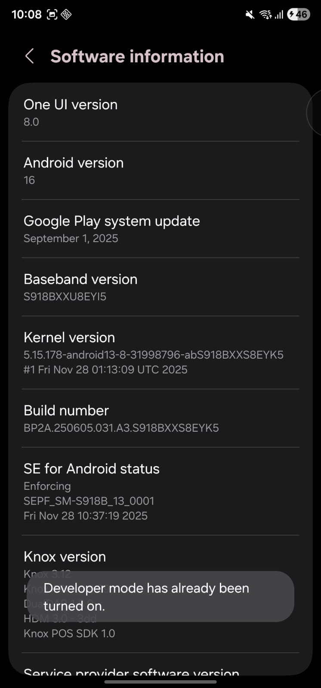

# LAB 1 : Mise en place du lab

## **1- Vérification de l’intégrité du fichier**

Le hash SHA-256 fourni par la page officielle correspond à celui obtenu par la commande, ce qui confirme l’intégrité du fichier Mobexler.ova.

---

## **2- Configuration du VM**

---

## **3- Vérification de l’installation et de la connectivité réseau**

**Host-Only:** IP 192.168.56.103  
**NAT:** IP 10.0.2.15

La connexion Internet a été vérifiée et fonctionne correctement

---

## **4- Création du snapshot**

On crée un snapshot comme point de restauration afin de pouvoir revenir à un état fonctionnel de la machine virtuelle en cas de dysfonctionnement lors des travaux pratiques.

---

## **5- Configuration de la cible Android**

**Verification :**

